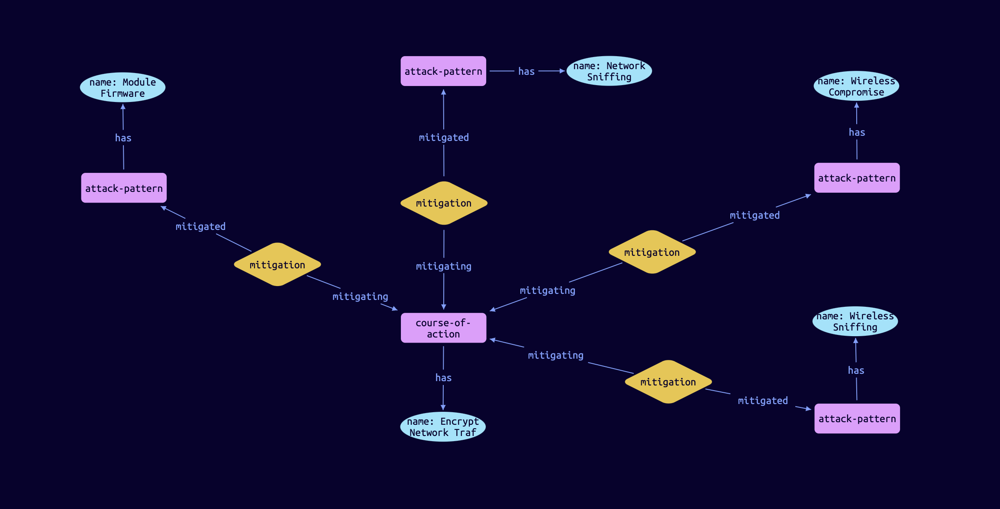
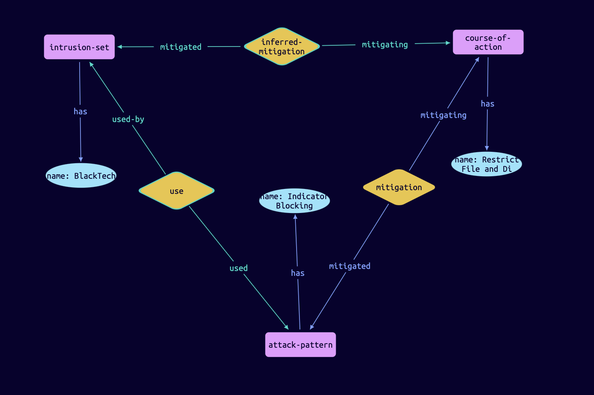
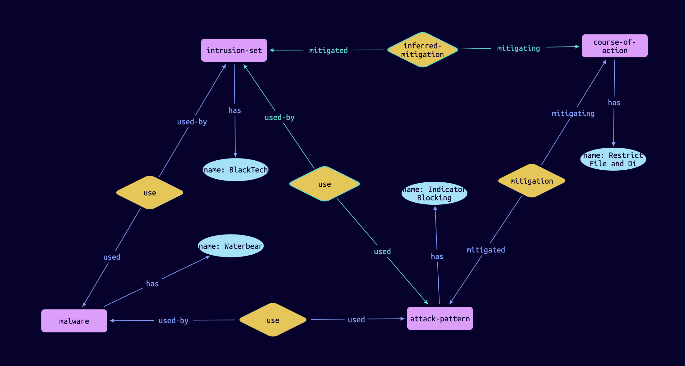

# TypeDB Data - CTI

**[Overview](#overview)** | **[STIX](#stix)** | **[MITRE ATT&CK Data](#mitre-attck-stix-data)** | **[Installation](#installation)** | **[Examples](#examples)**

[](https://vaticle.com/discord)
[](https://forum.vaticle.com)
[](https://stackoverflow.com/questions/tagged/typedb)
[](https://stackoverflow.com/questions/tagged/typeql)

## Overview
TypeDB Data - CTI is an open source knowledge graph for organisations to store and manage their cyber threat intelligence knowledge. It has been created to enable CTI professionals to bring together their disparate CTI information into one knowledge graph and find new insights about cyber threats.

This repository provides a schema that is based on [STIX2](https://oasis-open.github.io/cti-documentation/), and contains [MITRE ATT&CK](https://github.com/mitre-attack/attack-stix-data) as an example dataset to start exploring this CTI knowledge graph. In the future, we plan to incorporate other CTI standards and data sources, in order to create an industry-wide data specification in TypeQL that can be used to ingest any type of CTI data. 




## STIX

[Structured Threat Information Expression (STIX™)](https://oasis-open.github.io/cti-documentation/) is a language and serialization format used to exchange cyber threat intelligence (CTI).

STIX enables organizations to share CTI with one another in a consistent and machine readable manner, allowing security communities to better understand what computer-based attacks they are most likely to see and to anticipate and/or respond to those attacks faster and more effectively.

STIX is designed to improve many different capabilities, such as collaborative threat analysis, automated threat exchange, automated detection and response, and more.

The data model in TypeDB Data - CTI is currently based on STIX (specifically STIX 2.1), offering a unified and consistent data model for CTI information from an operational to strategic level. This enables the ingestion of heterogeneous CTI data to provide analysts with a single common language to describe the data they work with.  

To learn more about STIX, this [introduction](https://oasis-open.github.io/cti-documentation/stix/walkthrough) and [explanation](https://oasis-open.github.io/cti-documentation/examples/visualized-sdo-relationships) is a good place to start learning how STIX works and why TypeDB Data - CTI uses it. 

An in-depth overview of the how the STIX2 model has been implemented in TypeDB will follow. 

## MITRE ATT&CK STIX Data

[MITRE ATT&CK](https://github.com/mitre-attack/attack-stix-data) is a globally-accessible knowledge base of adversary tactics and techniques based on real-world observations. The ATT&CK knowledge base is used as a foundation for the development of specific threat models and methodologies in the private sector, in government, and in the cybersecurity product and service community.

TypeDB Data - CTI includes a migrator to load MITRE ATT&CK STIX and serves as an example datasets to quickly start exploring the knowledge graph. 

## Installation 

**Prerequesites**: Python >3.6,  [TypeDB Core 2.5.0](https://vaticle.com/download#core),  [TypeDB Python Client API 2.5.0](https://docs.vaticle.com/docs/client-api/python),  [TypeDB Studio 2.4.0-alpha-4](https://vaticle.com/download#typedb-studio).

Clone this repo:

```bash 
git clone https://github.com/typedb-osi/typedb-data-cti
```

Set up a virtual environment and install the dependencies:

```bash
cd <path/to/typedb-data-cti>/
python -m venv .venv
source .venv/bin/activate
pip install -r requirements.txt
```
Start TypeDB
```bash 
typedb server
```
Start the migrator script

```bash
python migrator.py
```
This will create a new database called `cti`, insert the schema file and ingest the MITRE ATTCK datasets; it will take one or two minutes to complete. 

## Examples

Once the data is loaded, these queries can be used to explore the data. 

1. What are the attack patterns used by the malware "FakeSpy"?
```
match 
$malware isa malware, has name "FakeSpy";
$attack-pattern isa attack-pattern, has name $apn;
$use (used-by: $malware, used: $attack-pattern) isa use; 
```

Running this query will return 15 different `attack-patterns`, all of which have a relation of type `use` to the `malware`. This is how it is visualised in TypeDB Studio: 


2. What attack patterns are used by the malwares that were used by the intrusion set APT28?
```
match 
$intrusion isa intrusion-set, has name "APT28"; 
$malware isa malware, has name $n1; 
$attack-pattern isa attack-pattern, has name $n2;
$rel1 (used-by: $intrusion, used: $malware) isa use; 
$rel2 (used-by: $malware, used: $attack-pattern) isa use; 
```
This query asks for the entity type `intrusion-set` with name `APT28`. It then looks for all the `malwares` that are connected to this `intrusion-set` through the relation `use`. The query also fetches all the `attack-patterns` that are connected through the relation `use` to these `malwares`.

The full answer returns 207 results. Two of those results can be visualised in TypeDB Studio like this: 


3. Does the "Restrict File and Directory Permissions" course of action mitigate the "BlackTech" intrusion set, and if so, how?
```
match
$course isa course-of-action, has name "Restrict File and Directory Permissions";
$in isa intrusion-set, has name "BlackTech";  
$mit (mitigating: $course, mitigated: $in) isa mitigation;
```
This query returns a relation of type `inferred-mitigation` between the two entities: 
 


But the `inferred-mitigation` relation does not actually exist in the database, it was inferred at query runtime by TypeDB's reasoner. By double clicking on the inferred relation, the explanation shows that the `course-of-action` actually mitigates an `attack-pattern` with the name `Indicator Blocking`, which has a `use` relation with the `intrusion-set`.



However, that `use` relation (between the `intrusion-set` and the `attack-pattern`) is also inferred. Double clicking on it shows that the `attack-pattern` is not directly used by the `intrusion-set`. Instead, it is used by a `malware` called `Waterbear`, which is used by the `intrusion-set`.



## Community
If you need any technical support or want to engage with this community, you can join the *#typedb-data-cti* channel in the [TypeDB Discord server](https://vaticle.com/typedb). 
